# eLearn-X: Bridging E-Learning Excellence with LMS Efficiency

## Project Overview

eLearn-X is a revolutionary educational platform that seamlessly combines the best features of prominent E-Learning platforms like Udemy and Coursera with the robust functionalities of Learning Management Systems (LMS) like D2L Brightspace and Blackboard. This project aims to provide an all-encompassing solution that enhances the e-learning experience for both students and faculty.

## Key Features

### Dual Login System
- Students and faculty members have separate login experiences, ensuring tailored interactions.

### Membership and Payment Integration
- Seamlessly integrated Stripe for secure and convenient payments.
- Students can easily purchase courses and memberships, including Gold, Silver, and Bronze tiers.

### Rich Course Interactions
- Engaging quizzes challenge students' knowledge.
- Assignment submission mechanism enables efficient student-teacher communication.
- Lecture slides provide comprehensive learning materials.
- Community groups facilitate collaborative learning among peers.

### Automated Email Workflow
- Automated emails are sent upon membership or course purchase.
- Emails contain access codes, ensuring swift and hassle-free access.

### Faculty Empowerment
- Faculty members can effortlessly add courses, lectures, assignments, and quizzes.
- The platform allows attendance marking and student grading.

## My Contributions

As the driving force behind eLearn-X, I undertook a multidimensional role in the project's development:

- **Full-Stack Development:** I meticulously architected and implemented the platform, ensuring a seamless user experience from login to course completion.

- **Membership and Payment Integration:** I intricately linked Stripe to enable secure and user-friendly payment transactions for course purchases and memberships.

- **Dynamic Course Interaction:** My expertise shines through in designing a rich course experience that includes quizzes, assignments, lecture slides, and community interaction.

- **Automated Email Workflow:** I established an automated email system, ensuring swift communication for course and membership access, as well as password reset requests.

- **Faculty Management Tools:** I equipped faculty with powerful tools to add and manage courses, assignments, and grading systems.

## Getting Started

To experience the power of eLearn-X, follow these steps:
1. Clone this repository.
2. Install the necessary dependencies by running `npm install`.
3. Start the server using `npm start`.

## User Interface
### Sign-Up
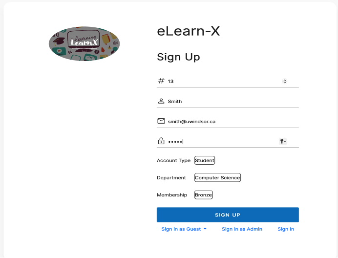

### Profile Page
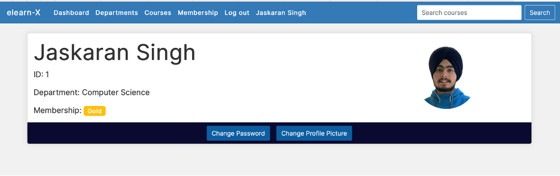

### Membership Page
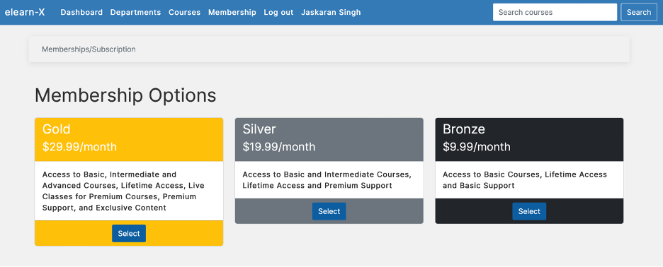

### All Courses page
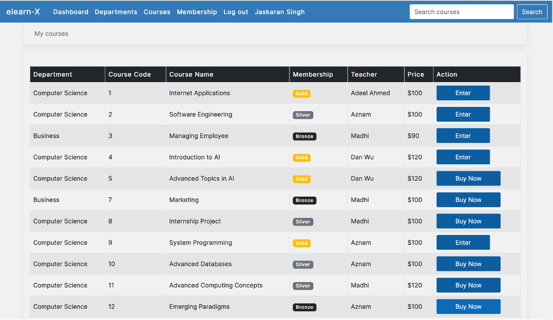

### Payment Page
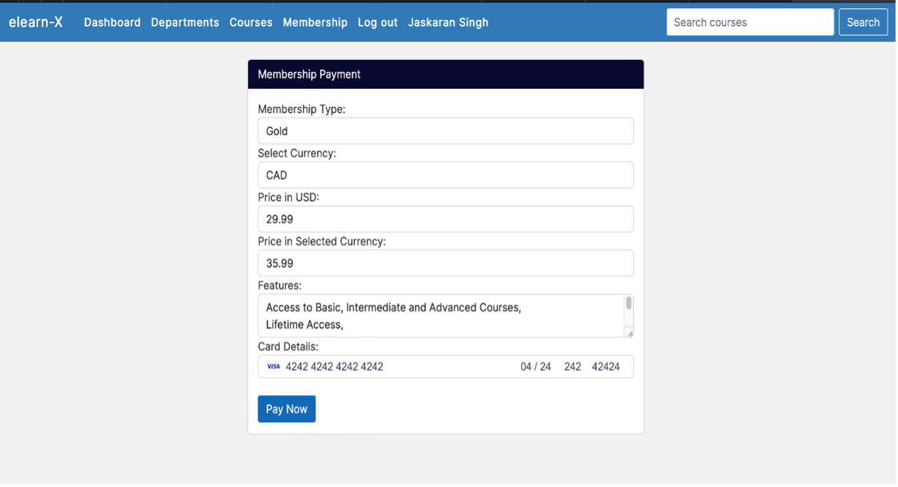

### Student Dashboard
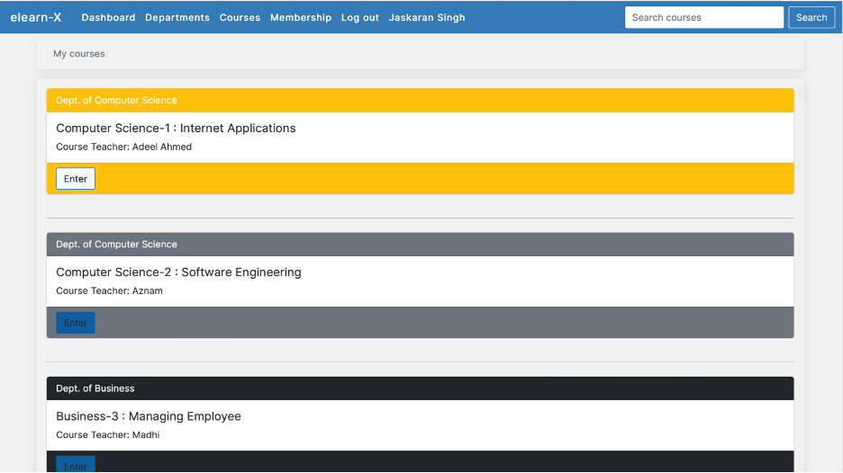

### Course Dashboard
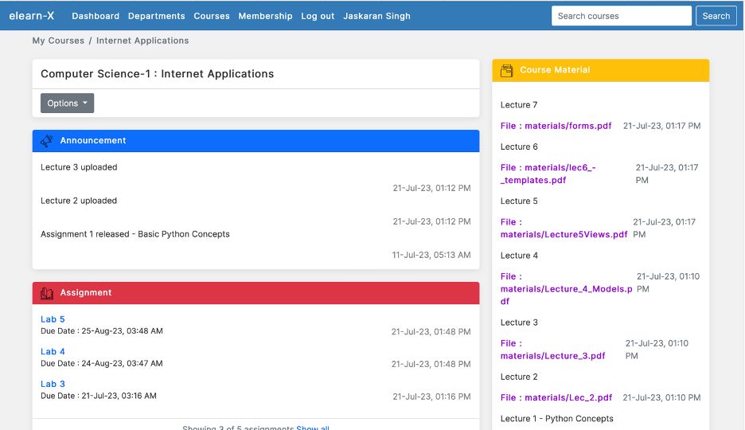

### Forgot Password
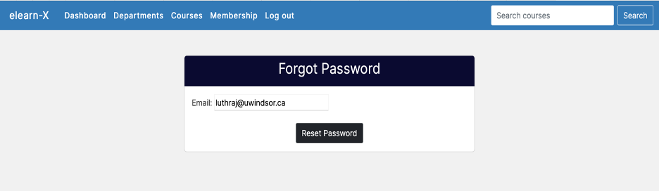

### Password Reset Email 
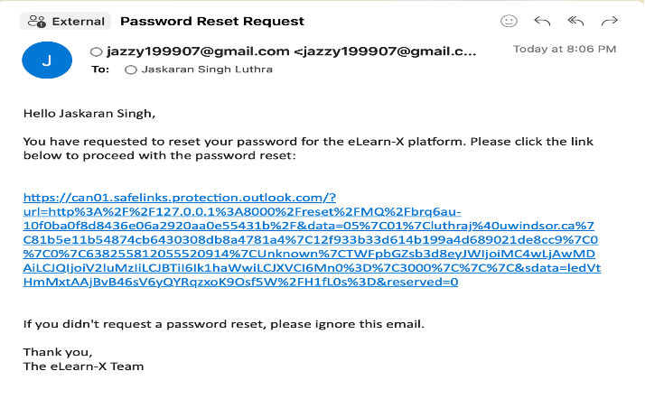

### Quiz Start page
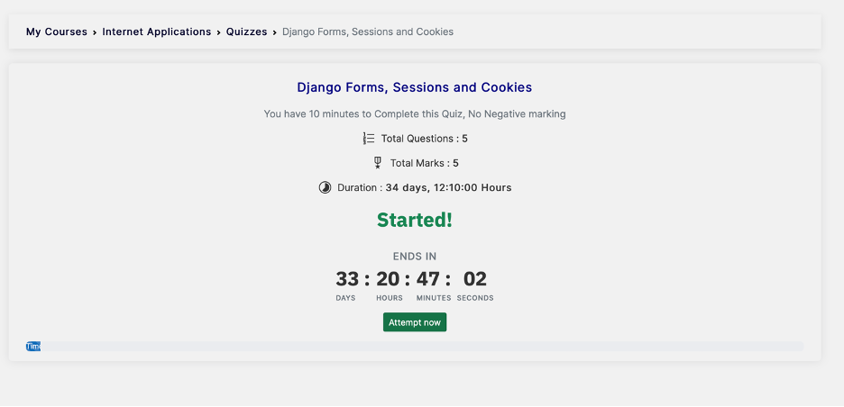

### Quiz Questions page
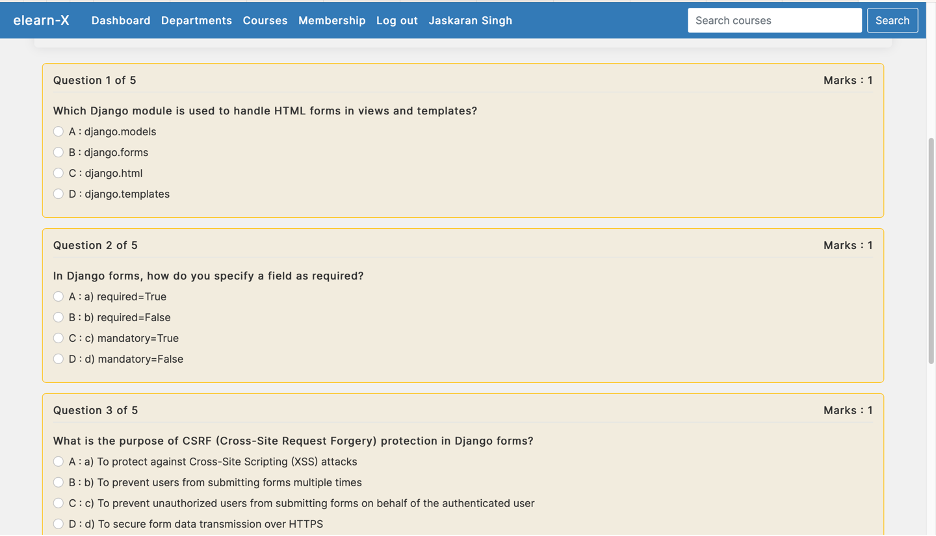

### Quiz Result page
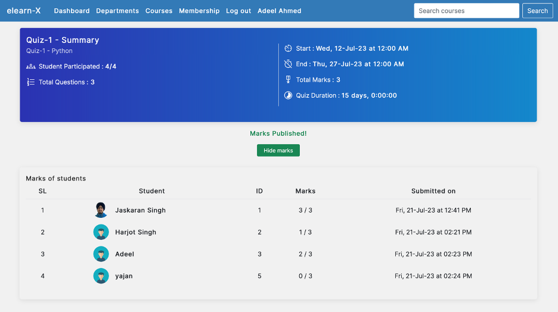

### Quiz Analysis page
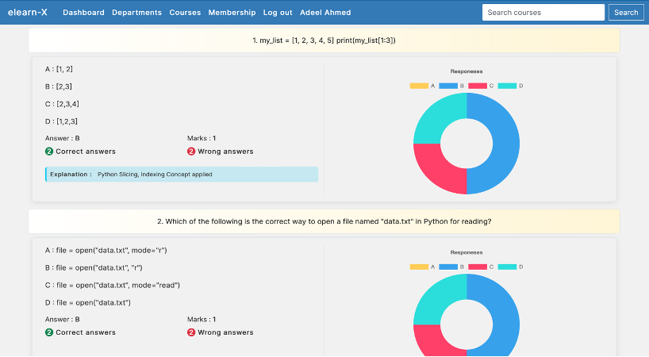

### Create Assignment page
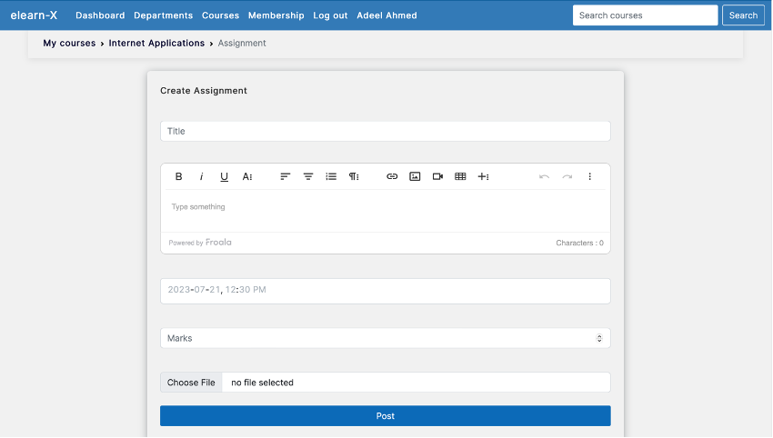

### Assignment Submission page
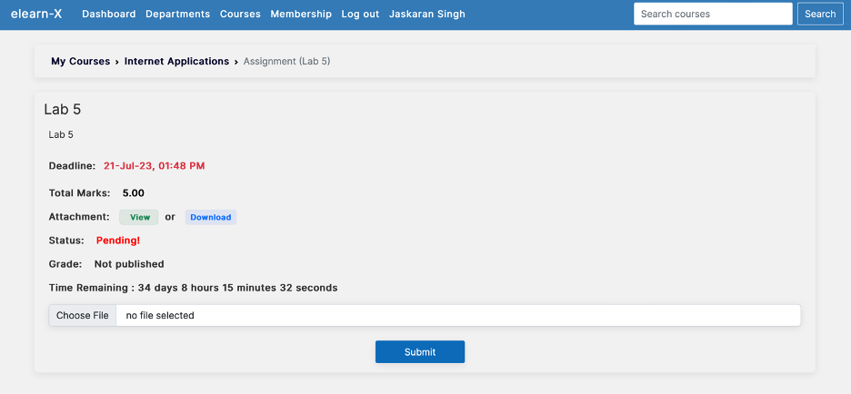

## Conclusion

eLearn-X redefines education by seamlessly fusing leading E-Learning features with the efficiency of LMS systems. With its comprehensive course interactions, secure payments, and automated workflows, eLearn-X empowers students and faculty alike. This project stands as a testament to my ability to transform concepts into impactful solutions.

Feel free to contribute, report issues, or provide feedback. Let's shape the future of e-learning together!

---

